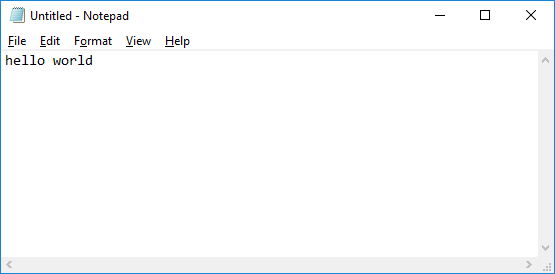

# .NET Exceptions - System.DllNotFoundException

Moving right along through our [__.NET Exception Handling__](https://airbrake.io/blog/dotnet-exception-handling/exception-class-hierarchy) series, today we'll take a closer look at the System.DllNotFoundException.  As indicated by the name, a `System.DllNotFoundException` occurs when attempting to import a `DLL` that doesn't exist.

In this article we'll examine the `System.DllNotFoundException` in more detail, including where it resides in the .NET exception hierarchy, along with a functional C# code example that imports a few `Win32` DLLs that allow our application to send keyboard inputs to other applications.  Let's get started!

## The Technical Rundown

- All .NET exceptions are derived classes of the [`System.Exception`](https://airbrake.io/blog/dotnet-exception-handling/exception-class-hierarchy) base class, or derived from another inherited class therein.
- [`System.SystemException`](https://docs.microsoft.com/en-us/dotnet/api/system.systemexception) is inherited from the [`System.Exception`](https://airbrake.io/blog/dotnet-exception-handling/exception-class-hierarchy) class.
- [`System.TypeLoadException`](https://docs.microsoft.com/en-us/dotnet/api/system.typeloadexception?view=netframework-4.7) inherits directly from [`System.SystemException`](https://docs.microsoft.com/en-us/dotnet/api/system.systemexception).
- Finally, `System.DllNotFoundException` inherits directly from [`System.TypeLoadException`](https://docs.microsoft.com/en-us/dotnet/api/system.typeloadexception?view=netframework-4.7).

## When Should You Use It?

For many .NET applications there may be little to no reason to import DLLs, since the more modern frameworks like .NET and its respective functionality provides most everything that may be required.  Now that .NET Framework has been the standard for well over a decade (and upwards of 15 years for some teams), fewer and fewer new applications are being developed that need to integrate with older `Win32`-style unmanaged functions.  Unfortunately, when your application _must_ perform actions outside its own domain, particularly interacting with other windows and applications, there's often no other option then to import some DLLs and get into the mess that is unmanaged code and APIs.

That's why the .NET Framework includes exceptions like the `System.DllNotFoundException`.  We'll use the rest of this article to explore a relatively simple example of using a `Win32` DLL to communicate between our C# application and another application: The one and only `notepad.exe`.

Below you can find the full working code example.  Feel free to glance over it or copy it to your own application if you're following along:

```cs
using System;
using System.Diagnostics;
using System.Runtime.InteropServices;
using System.Windows.Forms;
using Utility;

namespace Airbrake.DllNotFoundException
{
    class Program
    {
        static void Main(string[] args)
        {
            var isNotepadRunning = Process.GetProcessesByName("notepad");
            // Check if no processes found.
            if (isNotepadRunning.Length == 0)
            {
                // Create new process for notepad.exe.
                var process = new Process { StartInfo = { FileName = "c:/windows/notepad.exe" } };
                // Attempt to start the process using provided executable path.
                process.Start();
                // Wait until notepad is ready for user input (otherwise we'll send key posts before it can handle them).
                process.WaitForInputIdle();
            }

            // Create new Screen instance for Notepad input window.
            var screen = new Screen("Notepad", "Untitled - Notepad", "Edit");

            // Enter "hello world";
            screen.PostKeyDown(Keys.H);
            screen.PostKeyDown(Keys.E);
            screen.PostKeyDown(Keys.L);
            screen.PostKeyDown(Keys.L);
            screen.PostKeyDown(Keys.O);
            screen.PostKeyDown(Keys.Space);
            screen.PostKeyDown(Keys.W);
            screen.PostKeyDown(Keys.O);
            screen.PostKeyDown(Keys.R);
            screen.PostKeyDown(Keys.L);
            screen.PostKeyDown(Keys.D);

            // New line.
            screen.PostKeyDown(Keys.Return);
        }
    }

    public class Screen
    {
        public IntPtr Handle { get; set; }

        public enum VirtualKeyCodes : int
        {
            KeyDown = 0x0100,
            KeyUp = 0x0101,
        }

        // Find a child window.
        [DllImport("user32.dll", EntryPoint = "FindWindowEx")]
        public static extern IntPtr GetChildWindow(IntPtr parentWindowHandle, IntPtr childWindowHandle, string className, string windowName);

        // Find a window.
        [DllImport("user32.dll", EntryPoint = "FindWindow")]
        public static extern IntPtr GetWindow(string className, string windowName);

        // Find a window context.
        [DllImport("user32.dll")]
        public static extern IntPtr GetWindowDC(IntPtr hWindow);

        // Post a message to a window.
        [DllImport("user32.dll")]
        public static extern bool PostMessage(IntPtr windowHandle, VirtualKeyCodes message, int lowParam, int highParam);

        // Release a window context handle.
        [DllImport("user32.dll", EntryPoint = "ReleaseDC")]
        public static extern bool ReleaseContext(IntPtr windowHandle, IntPtr contextHandle);

        /// <summary>
        /// Instantiate by setting Handle to target child window.
        /// </summary>
        /// <param name="parentClassName">Parent window class name.</param>
        /// <param name="parentWindowName">Parent window caption name.</param>
        /// <param name="childClassName">Child window class name to find.</param>
        /// <param name="childWindowName">Child window caption name to find.</param>
        public Screen(string parentClassName, string parentWindowName, string childClassName = "", string childWindowName = "")
        {
            // Get parent window handle.
            var parentHandle = GetWindow(parentClassName, parentWindowName);
            // Get child window handle.
            Handle = GetChildWindow(parentHandle, (IntPtr)0, childClassName, childWindowName);
        }

        /// <summary>
        /// Destructor to dispose obtained handle.
        /// </summary>
        ~Screen()
        {
            // Release window handle reference.
            ReleaseContext(Handle, GetWindowDC(Handle));
        }

        /// <summary>
        /// Post key press (down) to window.
        /// </summary>
        /// <param name="key">Key to be pressed.</param>
        /// <returns>Indicates if message post was successful.</returns>
        public bool PostKeyDown(Keys key)
        {
            // Key down.
            return PostMessage(Handle, VirtualKeyCodes.KeyDown, (int)key, 0);
        }
    }
}

namespace Utility
{
    /// <summary>
    /// Houses all logging methods for various debug outputs.
    /// </summary>
    public static class Logging
    {
        /// <summary>
        /// When <see cref="Exception"/> parameter is passed, modifies the output to indicate
        /// if <see cref="Exception"/> was expected, based on passed in `expected` parameter.
        /// <para>Outputs the full <see cref="Exception"/> type and message.</para>
        /// </summary>
        /// <param name="exception">The <see cref="Exception"/> to output.</param>
        /// <param name="expected">Boolean indicating if <see cref="Exception"/> was expected.</param>
        public static void Log(Exception exception, bool expected = true)
        {
            string value = $"[{(expected ? "EXPECTED" : "UNEXPECTED")}] {exception.ToString()}: {exception.Message}";
#if DEBUG
            Debug.WriteLine(value);
#else
            Console.WriteLine(value);
#endif
        }
    }
}
```

The purpose of our example application is simple: Open Notepad (if not already open) and send a few keystrokes to the input window, resulting in `"hello world"` being input.

To get started we've created a `Screen` class that contains most of the window-based logic:

```cs
public class Screen
{
    public IntPtr Handle { get; set; }

    public enum VirtualKeyCodes : int
    {
        KeyDown = 0x0100,
        KeyUp = 0x0101,
    }

    //...
}
```

We begin with an instance property called `Handle` that will store the relevant window handle once we locate it.  We also have the `VirtualKeyCodes` enumeration that contains a few important key codes (the full list can be [found here](https://msdn.microsoft.com/en-us/library/windows/desktop/ms644927(v=vs.85).aspx#system_defined)).  Following that comes the most critical section of our code: Importing some unmanaged `Win32` functions from outside DLLs:

```cs
// Find a child window.
[DllImport("user32.dll", EntryPoint = "FindWindowEx")]
public static extern IntPtr GetChildWindow(IntPtr parentWindowHandle, IntPtr childWindowHandle, string className, string windowName);

// Find a window.
[DllImport("user32.dll", EntryPoint = "FindWindow")]
public static extern IntPtr GetWindow(string className, string windowName);

// Find a window context.
[DllImport("user32.dll")]
public static extern IntPtr GetWindowDC(IntPtr hWindow);

// Post a message to a window.
[DllImport("user32.dll")]
public static extern bool PostMessage(IntPtr windowHandle, VirtualKeyCodes message, int lowParam, int highParam);

// Release a window context handle.
[DllImport("user32.dll", EntryPoint = "ReleaseDC")]
public static extern bool ReleaseContext(IntPtr windowHandle, IntPtr contextHandle);
```  

For this example we're importing five different functions from `user32.dll`, though we could arguably get away with only two (`GetWindow` and `PostMessage`).  For those unfamiliar with using `DllImport()`, the syntax is similar to other `attributes` in C#, where we indicate the `DllImport()` settings _immediately prior to_ the function signature we're importing.  A few of the imported functions also include the `EntryPoint` property declaration for `DllImport()`, which indicates the explicit name of the function within the DLL library.  By specifying an `EntryPoint` value, this allows us to rename the function that will be available to the rest of our application, typically by making it something more appropriate or easier to use.  For example, we've changed the base name of `FindWindowEx` to `GetChildWindow`.

Next in the `Screen` class comes the constructor, an explicit destructor, and then a single helper method for sending keystrokes to the window:

```cs
/// <summary>
/// Instantiate by setting Handle to target child window.
/// </summary>
/// <param name="parentClassName">Parent window class name.</param>
/// <param name="parentWindowName">Parent window caption name.</param>
/// <param name="childClassName">Child window class name to find.</param>
/// <param name="childWindowName">Child window caption name to find.</param>
public Screen(string parentClassName, string parentWindowName, string childClassName = "", string childWindowName = "")
{
    // Get parent window handle.
    var parentHandle = GetWindow(parentClassName, parentWindowName);
    // Get child window handle.
    Handle = GetChildWindow(parentHandle, (IntPtr)0, childClassName, childWindowName);
}

/// <summary>
/// Destructor to dispose obtained handle.
/// </summary>
~Screen()
{
    // Release window handle reference.
    ReleaseContext(Handle, GetWindowDC(Handle));
}

/// <summary>
/// Post key press (down) to window.
/// </summary>
/// <param name="key">System.Windows.Input.Key to be pressed.</param>
/// <returns>Indicates if message post was successful.</returns>
public bool PostKeyDown(Keys key)
{
    // Key down.
    return PostMessage(Handle, VirtualKeyCodes.KeyDown, (int)key, 0);
}
```

As indicated by the comments, the single constructor method allows us to retrieve the handle of a _parent_ window first, and then retrieve (and set) the handle of a child window within that parent.  This is important for our purposes, because Notepad itself has a parent window (which contains the title and menus and such), but then the actual window where text is input is a child window with a class name of `"Edit"`.

The `~Screen()` destructor allows us to call `ReleaseContext()`, which aims to release the window context of our retrieved window handle during the finalization process (after we're all done with the `Screen` instance).  This step isn't necessary, but illustrates some extra functionality we're pulling from the `Win32` unmanaged code.

Finally, `PostKeyDown()` accepts a passed `Key`, then uses the imported `PostMessage()` function to post a message to the handle of our window.  We also need to pass a valid `VirtualKeyCode`, so here we're using `KeyDown`.

That's most of the setup.  Now we can try testing it out in `Program.Main()`:

```cs
class Program
{
    static void Main(string[] args)
    {
        var isNotepadRunning = Process.GetProcessesByName("notepad");
        // Check if no processes found.
        if (isNotepadRunning.Length == 0)
        {
            // Create new process for notepad.exe.
            var process = new Process { StartInfo = { FileName = "c:/windows/notepad.exe" } };
            // Attempt to start the process using provided executable path.
            process.Start();
            // Wait until notepad is ready for user input (otherwise we'll send key posts before it can handle them).
            process.WaitForInputIdle();
        }

        // Create new Screen instance for Notepad input window.
        var screen = new Screen("Notepad", "Untitled - Notepad", "Edit");

        // Enter "hello world";
        screen.PostKeyDown(Keys.H);
        screen.PostKeyDown(Keys.E);
        screen.PostKeyDown(Keys.L);
        screen.PostKeyDown(Keys.L);
        screen.PostKeyDown(Keys.O);
        screen.PostKeyDown(Keys.Space);
        screen.PostKeyDown(Keys.W);
        screen.PostKeyDown(Keys.O);
        screen.PostKeyDown(Keys.R);
        screen.PostKeyDown(Keys.L);
        screen.PostKeyDown(Keys.D);

        // New line.
        screen.PostKeyDown(Keys.Return);
    }
}
```

We start by verifying if the `notepad` process is already running by checking by name.  If the result has no length, that indicates no process was found, so we create a new `Process` instance with the location of `notepad.exe` passed in, then `Start()` it up.  Since this code is entirely synchronous, it's also important that we don't start sending key post messages to the window before it has fully loaded.  Therefore, by calling `process.WaitForInputIdle()` the application will wait for Notepad to load up and accept user input before continuing.

With Notepad ready to go we create a new `Screen` instance and pass in the `parent class name` ("Notepad"), `parent window name` ("Untitled - Notepad"), and `child class name` ("Edit").  This sets the `screen.Handle` property to the child input window of Notepad, which can actually accept our text input.

Finally, we send some inputs using `PostKeyDown()`.  In this case, we're sending the standard "hello world" string, followed by `Return` to create a new line.

Sure enough, running this code works as expected; Notepad is opened (if it wasn't already) and "hello world" is printed to the editing window!



Now that we have a working application that is successfully importing outside `Win32` DLLs, let's make a very minor tweak and see what happens.  Here we're modifying one `DllImport()` method call line with a small typo, changing `user32.dll` to `user23.dll`.  We're also adding a `try-catch` block to our `Screen()` constructor method so we can catch any exceptions:

```cs
[DllImport("user23.dll", EntryPoint = "FindWindowEx")]
public static extern IntPtr GetChildWindow(IntPtr parentWindowHandle, IntPtr childWindowHandle, string className, string windowName);

//...

public Screen(string parentClassName, string parentWindowName, string childClassName = "", string childWindowName = "")
{
    try
    {
        // Get parent window handle.
        var parentHandle = GetWindow(parentClassName, parentWindowName);
        // Get child window handle.
        Handle = GetChildWindow(parentHandle, (IntPtr)0, childClassName, childWindowName);
    }
    catch (System.DllNotFoundException exception)
    {
        Logging.Log(exception);
    }
    catch (Exception exception)
    {
        Logging.Log(exception, false);
    }
}
```

Now that we're attempting to import an invalid DLL, as you might expect, attempting to run our application throws a `System.DllNotFoundException` at us:

```
[EXPECTED] System.DllNotFoundException: Unable to load DLL 'user23.dll': The specified module could not be found. (Exception from HRESULT: 0x8007007E)
```

To get the most out of your own applications and to fully manage any and all .NET Exceptions, check out the <a class="js-cta-utm" href="https://airbrake.io/languages/net_bug_tracker?utm_source=blog&amp;utm_medium=end-post&amp;utm_campaign=airbrake-net">Airbrake .NET Bug Handler</a>, offering real-time alerts and instantaneous insight into what went wrong with your .NET code, along with built-in support for a variety of popular development integrations including: JIRA, GitHub, Bitbucket, and much more.

---

__META DESCRIPTION__

A close look at the System.DllNotFoundException in .NET, including a functional C# code sample illustrating how to import and use Win32 DLLs and APIs.