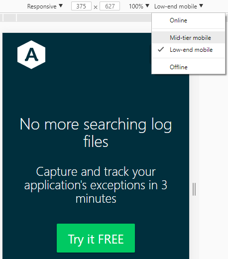

# New Development Tools in Chrome 61

The latest version of the popular Chrome browser was officially released this week, and with it comes a handful of exciting new features for developers and technical managers alike.  From out of the box ES6 module support and mobile device throttling to WebUSB API support and storage usage statistics, there are a bunch of new development tools in Chrome!

Moreover, Chrome continues to dominate the browser market with a _vast_ and continually rising lead over the competition.  According to [recent statistics gathered from billions of page views worldwide](http://gs.statcounter.com/browser-market-share), as of August 2017 Chrome has approximately `55%` global market share.  By comparison, its next closest competitor, Safari, clocks in at less than a third of that with around `15%` of the market.  Moreover, Chrome has been reliably gaining about half a percent of the market every month for a few years now, with no signs of stopping.


## ES6 Module Support

Safari was the first major browser to provide ES6 module support out of the box, and now Chrome 61 joins the club, instantly ensuring roughly 70% of the worldwide userbase can freely use applications that take advantage of ES6 modules, without the need for a third-party transpiler.  This is great news and an amazing trend for developers.  While older browser support is always a concern, the technical landscape is constantly shifting and adjusting to the needs of the majority.  Just as we're now seeing Adobe Flash lose support (Adobe itself is planning to [end-of-life Flash](https://blogs.adobe.com/conversations/2017/07/adobe-flash-update.html) by the end of 2020), ES6 modules have quickly become a dominant form of organizing code within large JavaScript applications.  While a full explanation of ES6 modules is beyond the scope of this article, we'll briefly look at how they work and what benefit they provide.

ES6 modules allow code to be selectively [`exported`](https://developer.mozilla.org/en-US/docs/Web/JavaScript/Reference/Statements/export) and [`imported`](https://developer.mozilla.org/en-US/docs/Web/JavaScript/Reference/Statements/import) across various files (i.e. `modules`).  This makes it much easier to keep code separate and far more object-oriented, while explicitly importing and exporting only the particular functionality (modules) that are required.  Here's a simple example of exporting the `add(x, y)` function from the `add.js` file, then importing it in the `test.js` file, where it can be used as normal:

```js
// add.js
export function add(x, y) {
    return x + y;
}

// test.js
import {add} from './add.js';

var x = 42;
var y = 24559;
console.log(`${x} + ${y} = ${add(x, y)}`);
```

If you're running the latest version of Chrome (or Safari), you can test ES6 modules for yourself by checking out the [ESModules Todo MVC](https://paulirish.github.io/es-modules-todomvc/) project.

## Simulate Mobile Device Throttling

Chrome 61 also adds to the already-powerful `mobile device` toolbar by adding the ability to select mid- and low-tier device profiles.  This is a convenient way to throttle performance and test different device configurations with just a few clicks of a button.  Access this new feature by opening the `device toolbar` (`Ctrl + Shift + M`), then selecting the `Online` dropdown menu:



## Access USB Devices With the WebUSB API

Another awesome new feature is support for the WebUSB API, which allows web apps to communicate with USB devices, once user consent is given.  This opens up a ton of cool possibilities for the future of web application and hardware interoperability, but may also worry both users and developers when it comes to privacy and security concerns.  Check out the full [`WebUSB spec`](https://wicg.github.io/webusb/) document to learn exactly how the API aims to handle such concerns.

## View Current Storage Usage

You can now also take a look at how much storage space the current [origin](https://tools.ietf.org/html/rfc6454#section-3.2) is using within the `DevTools` (`Ctrl + Shift + I`) > `Application` > `Application` > `Clear storage` screen:


Best of all, this data is broken down into each type of storage technology, such as `IndexedDB`, `Web SQL`, `local`, `session`, and so forth.

## Toggle the FPS Meter Via the Command Menu

The [`command menu`](https://developers.google.com/web/updates/2016/04/devtools-digest-command-menu) (`Ctrl + Shift P`) is a convenient way to quickly perform common actions during development and testing.  Chrome 61 has now added the ability to toggle the `FPS meter` panel through the `command menu`, providing a convenient way to check framerate performance in your applications.


---

__META DESCRIPTION__

A brief overview of some of the cool new development tools in Chrome 61, including native ES6 module and WebUSB API support.

---

__SOURCES__

- http://gs.statcounter.com/browser-market-share
- https://blogs.adobe.com/conversations/2017/07/adobe-flash-update.html
- https://paulirish.github.io/es-modules-todomvc/